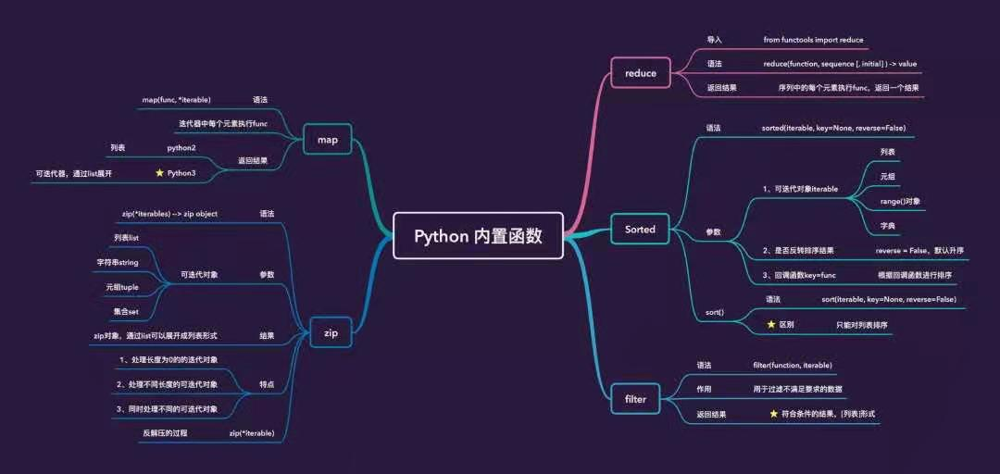

# 高阶函数总结

----



- [高阶函数总结](#高阶函数总结)
  - [1. 什么是高阶函数](#1-什么是高阶函数)
  - [2. 内建高阶函数](#2-内建高阶函数)
    - [2.1 map](#21-map)
    - [2.2 reduce](#22-reduce)
    - [2.3 filter](#23-filter)
    - [2.4 sorted](#24-sorted)
    - [2.5 zip](#25-zip)
  - [3. 自定义高阶函数](#3-自定义高阶函数)

## 1. 什么是高阶函数

**高阶函数** 是接收函数作为参数或返回值的函数，是函数式编程的重要组成

## 2. 内建高阶函数

### 2.1 map

`map`函数的语法是`map(func, seq)`, 其含义是：对`seq`中可迭代序列中的每个元素执行前面`func`的功能，最终获得一个新的序列。

* `python2` 直接返回的是列表
* `python3` 返回的是可迭代器，想返回列表要用`list()`处理

### 2.2 reduce

`reduce` 函数定义`reduce(f, seq, [, inital])`。

`reduce`依次从`seq`中取一个元素，和上一次`f`调用结果作为参数，再次调用`f`。

> 如果`inital`有值，会用`seq`第一个元素和`inital`作为参数调用，否则会以`seq`第一个参数和第二个参数作为调用

### 2.3 filter

`filter`函数定义`filter(f, iterable)`，用于过滤序列，过滤掉不符合条件的那些元素，返回符合条件的元素组成新的序列。

用每个元素传递给`f`，判断返回的`True or Flase`，过滤成为新列表。

### 2.4 sorted

`sorted`定义`sorted(iterable, key=None, reverse=False)`。

* `iterable` 迭代序列
* `reverse=False` 是否反转排序结果，默认不反转
* `key=None` 回调函数传入，只能有一个参数，使用返回值进行排序

> `sort`函数与`sorted`函数基本一致，唯一不同是，`sort`在原列表排序修改，`sorted`返回一个新的列表

### 2.5 zip

`zip`函数定义`zip([iterable,...])`, 将列表中多个可迭代对象合并成元组，`python3`返回的是`zip.Ojbect`, `python2`返回列表。

## 3. 自定义高阶函数

自定义一个高阶函数非常简单，只需要简单将函数作为**参数**:

```python
def tony(f, a):
    return f(a)
```

或作为**返回值**:

```
def pony():
    def _gg(x):
        return x + 1
    return _gg
```

再利用python函数的动态参数属性`func(*args,**kwargs)` 返回`tuple`或`dict`作为结果，再嵌套，就可以实现一个**函数式编程**的实例：

```python
#!/usr/bin/python3

def pony():
    def _gg(x):
        return x + 1
    return _gg

def tony(f, a):
    return f(a)

def haha():
    return (pony(), 2)

def main():

    print(tony(*haha()))

if __name__ == "__main__":
    main()
```

> *args，函数参数前带 `*` 解元组作为参数
> *kwargs, 函数参数前带 `**` 解字典作为参数
